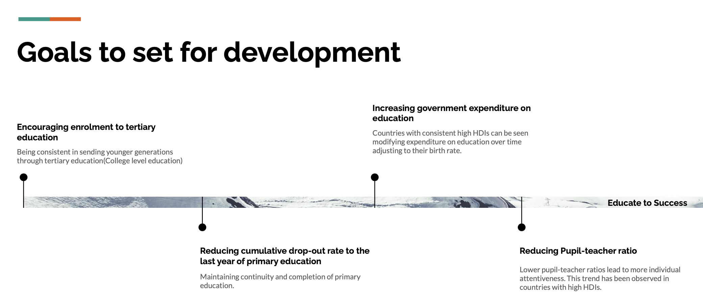

# educate-to-success

- `app-1` contains code for the shiny app deloyed at https://iyer-arjun.shinyapps.io/app-1/.
- `report.pdf` contains the report for the project.
- `report.Rmd` contains the R code used for the analysis steps.
- `Datasets` used: 
  - https://www.kaggle.com/datasets/theworldbank/education-statistics
  - https://www.kaggle.com/datasets/tjysdsg/human-development-index
- `Data Source`: 
  - Educational Indicators Data - World Bank - https://databank.worldbank.org/reports.aspx?source=2&Topic=4
  - Human Development Index Data - United Nations Development Program - https://hdr.undp.org/data-center
  

